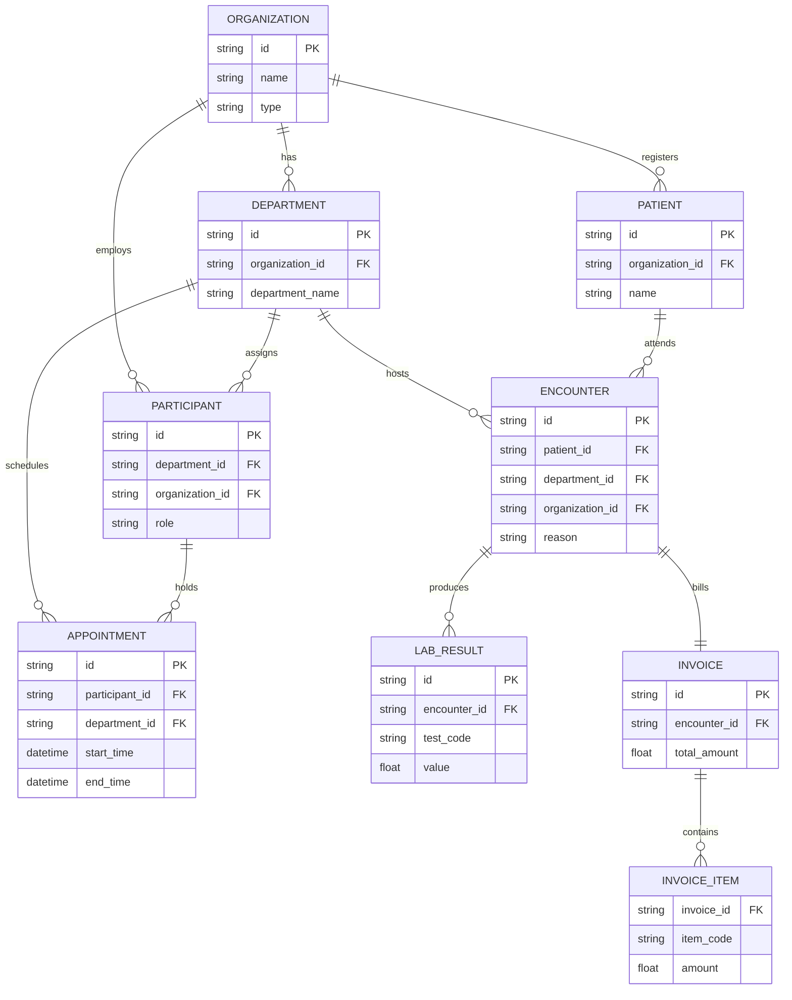

```mermaid
erDiagram
    ORGANIZATION ||--o{ DEPARTMENT : has
    ORGANIZATION ||--o{ PATIENT : registers
    ORGANIZATION ||--o{ PARTICIPANT : employs
    DEPARTMENT ||--o{ PARTICIPANT : assigns
    DEPARTMENT ||--o{ ENCOUNTER : hosts
    DEPARTMENT ||--o{ APPOINTMENT : schedules
    PARTICIPANT ||--o{ APPOINTMENT : holds
    PATIENT ||--o{ ENCOUNTER : attends
    ENCOUNTER ||--o{ LAB_RESULT : produces
    ENCOUNTER ||--|| INVOICE : bills
    INVOICE ||--o{ INVOICE_ITEM : contains

    ORGANIZATION {
        string id PK
        string name
        string type
    }

    DEPARTMENT {
        string id PK
        string organization_id FK
        string department_name
    }

    PARTICIPANT {
        string id PK
        string department_id FK
        string organization_id FK
        string role
    }

    PATIENT {
        string id PK
        string organization_id FK
        string name
    }

    ENCOUNTER {
        string id PK
        string patient_id FK
        string department_id FK
        string organization_id FK
        string reason
    }

    LAB_RESULT {
        string id PK
        string encounter_id FK
        string test_code
        float value
    }

    INVOICE {
        string id PK
        string encounter_id FK
        float total_amount
    }

    INVOICE_ITEM {
        string invoice_id FK
        string item_code
        float amount
    }

    APPOINTMENT {
        string id PK
        string participant_id FK
        string department_id FK
        datetime start_time
        datetime end_time
    }
```
